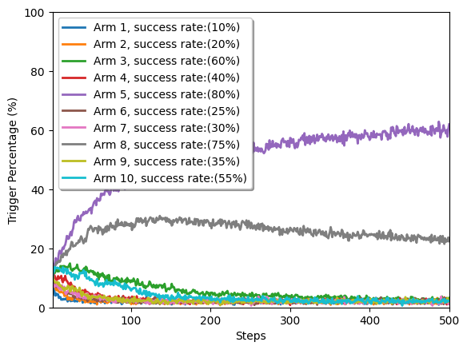
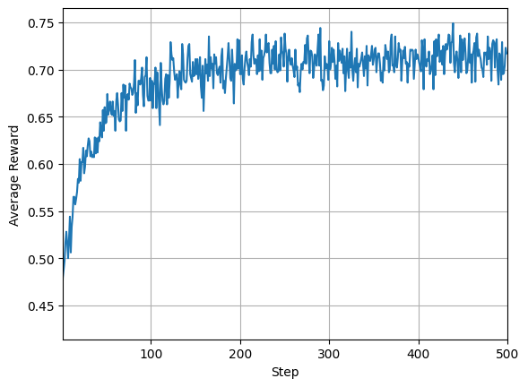

# Practice: Multi-armed Bandit Problem

The multi-armed bandit problem is a slot machien with n arms. Each arm has its own rigged probability of success. The player could randomly choose the arms to give him/her a stochastic reward for success (p.s. in this sample, the reward is just only either 1 for success or 0 for failure). The goal of this problem is to pull the arms one by one in the range of episodes such that the player can maximize the total reward.

## Implementation

We take the epsilon-greedy policy to play the multi-armed bandit. The agent represented as us to take the policy to join the multi-armed bandit game. In the fixed number of episodes, the agent uses the classic RL method, epsilon-greedy policy, to try its best get the maximal reward. Below the figures are shown: the percent of each choosed arm for each steps and average reward for each steps.

## Reference
* ankonzoid. Solving the Multi-armed Bandit Problem, github, 2020, ref: https://github.com/ankonzoid/LearningX/tree/master/classical_RL/multiarmed_bandit
* Richard S. Sutton and Andrew G. Barto. Reinforcement Learning: An Introduction, MIT Press, 2018.